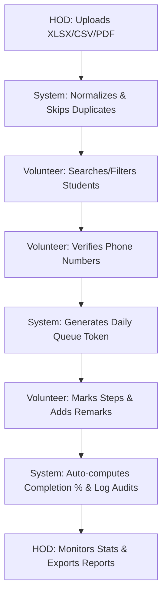

# Smart Admission Tracking & Verification System

[](#)
[](#)
[](#)
[](#)

A secure, high-performance web portal designed for tracking, managing, and verifying student admissions in real-time. Built with a robust role-based access control (RBAC) architecture, the system provides separate dashboards for Head of Departments (HODs) and Admission Volunteers, enabling efficient bulk imports, status tracking, queuing, and activity audit trails.

---

## 🚀 Key Features

*   **Role-Based Access Control (RBAC)**: Enforced segregation of duties between HOD/Admin and Volunteer accounts.
*   **HOD Analytics Portal**: Comprehensive dashboard showing real-time statistics, completion progress rings, and department performance metrics.
*   **Volunteer Workflow Management**: Clean, mobile-friendly interface for verifying student contacts, generating tokens, and tracking multi-step check-ins.
*   **Automated Queue/Token System**: High-concurrency daily-resetting queue sequence generation (timezone-aware).
*   **Smart Bulk Importer**: Robust file parser handling Excel (`.xlsx`, `.xls`), CSV, and PDF datasets with smart header mapping and automatic duplicates skipping.
*   **Dynamic Data Exporting**: Quick download of filtered datasets to Excel (`.xlsx`) or custom-styled PDFs, complete with filter-based file naming.
*   **Real-time Socket.IO Syncing**: Real-time push updates for status updates, notifications, and activity feed logs.
*   **Comprehensive Audit Logs**: Complete state change histories, showing old vs. new values, author, and timestamp.
*   **Production Optimized Layouts**: Instant loading (no artificial splash screens), hardware-accelerated layouts, and scrollable responsive overlays.

---

## 🛠️ Technology Stack

| Layer | Technology | Key Packages / Utilities |
| :--- | :--- | :--- |
| **Frontend** | React 18, Vite | React Router DOM, Socket.io Client, Axios, TailwindCSS, Lucide Icons |
| **Backend** | Node.js, Express | Multer (File Handling), Mongoose, Socket.io, JWT, BcryptJS |
| **Database** | MongoDB | Transactional Daily Sequences, Text Search Indexes, Multi-key Compound Indexes |
| **Export Engines**| XLSX, jsPDF | `xlsx` (Excel engine), `jspdf-autotable` (PDF report formatter) |

---

## 📁 System Architecture

```
smart-admission-system/
├── client/                     # React Frontend
│   ├── public/                 # Static assets & SPA routing configurations
│   ├── src/
│   │   ├── components/         # Common, layout, and domain components
│   │   ├── context/            # Global React Contexts (Auth, Socket, Toast)
│   │   ├── pages/              # Primary route views (Dashboard, Logs, Upload)
│   │   ├── services/           # Axios HTTP request configurations
│   │   └── utils/              # Helper functions & constant definitions
│   └── package.json
│
└── server/                     # Express Backend
    ├── config/                 # Environment and DB initializers
    ├── controllers/            # Route business logic handlers
    ├── middleware/             # Express handlers (Auth verify, RBAC authorize)
    ├── models/                 # Mongoose schemas (Student, AuditLog, DailyCounter)
    ├── routes/                 # Express REST endpoint maps
    ├── services/               # File parsers and database transaction runners
    └── package.json
```

---

## 🚦 Getting Started

### Prerequisites
*   Node.js (v16.0.0 or higher)
*   MongoDB (v5.0 or higher, Local or Atlas Cloud URI)
*   npm (v8.0.0 or higher)

### Setup & Installation

1.  **Clone the Repository**
    ```bash
    git clone <repository-url>
    cd smart-admission-system
    ```

2.  **Configure & Launch the Backend Server**
    ```bash
    cd server
    # Copy env template and modify variables
    cp .env.example .env
    
    # Install server dependencies
    npm install
    
    # Populate the database with default test users
    npm run seed
    
    # Start server in development mode
    npm run dev
    ```
    *Note: The server will run on `http://localhost:5000`.*

3.  **Configure & Launch the React Client**
    ```bash
    cd ../client
    # Install client dependencies
    npm install
    
    # Run the client dev server
    npm run dev
    ```
    *Note: The React development server will start on `http://localhost:5173`.*

---

## 🔑 Default Credentials

The database seeder configures standard accounts for testing role permissions across various branches:

| Department | HOD / Admin Credentials | Volunteer Credentials |
| :--- | :--- | :--- |
| **CSE** | `admin` / `admin123` | `volunteer` / `vol123` |
| **AIML**| `hod_aiml` / `hod123` | `volunteer_aiml` / `vol123` |
| **CIC** | `hod_cic` / `hod123` | `volunteer_cic` / `vol123` |

---

## 📋 Admission Workflow



### 1. Data Ingestion (HOD/Admin)
*   Login as an HOD. Go to the **Upload** section.
*   Upload a student record dataset. Supported formats include `.xlsx`, `.csv`, and `.pdf`.
*   Preview parsed columns. The parser uses regex to normalize header names automatically (e.g. mapping `htno`, `hall_ticket_no`, or `hall ticket number` to `hallTicketNumber`).
*   Confirm upload to parse and insert students. Duplicates with the same `hallTicketNumber` are automatically filtered out.

### 2. Physical Verification & Queuing (Volunteer)
*   Volunteers log in and automatically see student records matching *only* their department.
*   Locate the student via live search or rank filters.
*   Click **Generate Token** to trigger the contact verification modal.
*   Input verified student and parent numbers to request a daily resetting queue number (IST timezone-aware).

### 3. Admission Process Tracking (Volunteer)
*   Update individual milestones in the student card:
    *   **Self Reported** (Student has completed online self-reporting)
    *   **Documents Submitted** (Physical documents handed in)
    *   **Form Filled** (Admission forms completed and processed)
*   The backend automatically calculates the overall completion percentage (`0%`, `33%`, `67%`, `100%`) and timestamps the record upon completion.

---

## 📑 API Endpoints

### 🔐 Authentication (`/api/auth`)
*   `POST /login` - Sign in and receive JWT token.
*   `GET /me` - Fetch profile metadata for the authenticated session.

### 🎓 Students (`/api/students`)
*   `GET /` - Paginated and filterable student records list (*all authenticated roles*).
*   `GET /:id` - Fetch detailed profile card with recent audit log trail (*all authenticated roles*).
*   `PUT /:id/status` - Modify checklist milestones and remarks (*Volunteer only*).
*   `POST /:id/generate-token` - Generate a daily sequence number (*Volunteer only*).
*   `GET /export/all` - Fetch full dataset based on filters (*HOD/Admin only*).
*   `DELETE /:id` - Soft-delete a student (*HOD only*).
*   `DELETE /bulk/all` - Clear all student tables (*Admin only*).

### 📊 Analytics (`/api/dashboard`)
*   `GET /stats` - Fetch real-time count summaries and department matrices (*HOD/Admin only*).

### 📜 System Log (`/api/logs`)
*   `GET /` - Paginated global system logs (*all authenticated roles*).

---

## ⚡ Deployment & Build Optimization

### Production Checklist
1.  Configure environment variables in the hosting panel:
    *   `NODE_ENV=production`
    *   `PORT=5000`
    *   `MONGO_URI` (Production MongoDB cluster endpoint)
    *   `JWT_SECRET` (A cryptographically secure key string)
2.  Set `VITE_API_URL` (pointing to the backend endpoint URL, e.g. `https://api.yourdomain.com`).
3.  Vite generates static build assets inside `client/dist`. The system includes:
    *   [Vercel configuration](file:///c:/Users/Manikanta%20Sai/Smart%20Admission%20System/smart-admission-system/client/vercel.json) to handle Single Page App (SPA) routes.
    *   [Netlify routing config](file:///c:/Users/Manikanta%20Sai/Smart%20Admission%20System/smart-admission-system/client/public/_redirects) for clean redirect rewrites.

### Compile Verification
Build compilation checks can be verified using:
```bash
cd client
npm run build
```
The client builds cleanly in under 15 seconds, creating highly optimized, code-splitted production assets.
